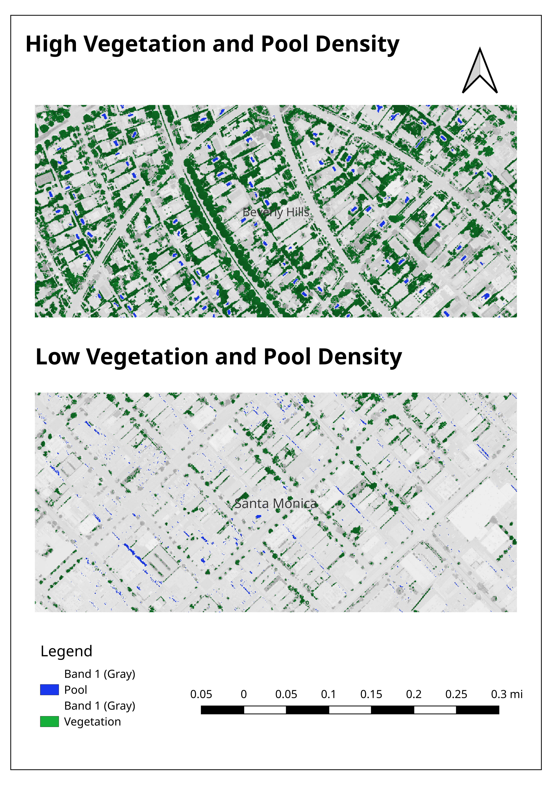

# Mapping Vegetation & Swimming Pools in Los Angeles  
## A Remote Sensing & GIS Analysis

---

## Project Overview

This project demonstrates advanced remote sensing analysis and GIS spatial modeling using high-resolution 4-band NAIP aerial imagery of Los Angeles’ Westside.

The primary objective is to extract meaningful insights about urban vegetation patterns and swimming pool distribution through raster analysis, spectral indices, and vector-based zonal statistics.

By completing this analysis, I showcase proficiency in industry-standard geospatial technologies and analytical methods directly applicable to careers in urban planning, environmental consulting, precision agriculture, and geospatial intelligence.

---

## Learning Objectives Achieved

- Multi-band raster visualization and interpretation (True Color, Color-Infrared)
- Calculation of Normalized Difference Vegetation Index (NDVI)
- Raster calculator operations and threshold-based classification
- Zonal statistics aggregation using rectangular and hexagonal grids
- Advanced map layout design with vector/raster integration
- Critical evaluation of spectral anomalies and false positives in classification

---

## Technical Skills Demonstrated

| Skill Category      | Specific Techniques | Relevance to Industry |
|---------------------|--------------------|-----------------------|
| Remote Sensing | Multi-band image processing, NDVI calculation, spectral signature interpretation | Environmental monitoring, agriculture, forestry |
| Raster Analysis | Reclassification, binary masking, raster calculator | Core GIS analytical competency |
| Vector Analysis | Grid generation, spatial overlay, polygon labeling | Urban planning, real estate analysis |
| Spatial Statistics | Zonal statistics, density aggregation, pattern analysis | Data-driven policy and planning |
| Cartography | Print layout design, color theory, blending modes | Professional reporting and visualization |
| Critical Thinking | Identifying false positives, interpreting land use patterns | Applied consulting problem-solving |

---

## Data Sources

- **NAIP (National Agricultural Imagery Program), 2020**
  - 4-band imagery (Red, Green, Blue, Near-Infrared)
  - 1-meter spatial resolution

- **Los Angeles Neighborhood Boundaries**
  - Polygon layer of Westside communities (Santa Monica, Venice, Mar Vista)

---

## Methodology

### 1. Image Visualization

- **True Color Map (RGB):** Standard natural color composite using bands 1, 2, 3  
- **Color-Infrared (CIR):** False-color composite (NIR, Red, Green) highlighting vegetation health  

---

### 2. Spectral Index Calculation

\[
NDVI = (NIR - Red) / (NIR + Red)
\]

- Value range: -1 to 1  
- Vegetation threshold: > 0.3  
- Swimming pool threshold: < -0.45  

---

### 3. Density Analysis Using Grids

- **Rectangular grid (200m cells):** Vegetation density via zonal statistics on NDVI > 0.3 mask  
- **Hexagonal grid (200m cells):** Swimming pool density via zonal statistics on NDVI < -0.45 mask  

Hexagonal grids were selected to reduce directional bias and improve spatial visualization consistency.

---

### 4. Advanced Visualization

- Grayscale base imagery with:
  - Green overlay (NDVI > 0.3)
  - Blue overlay (NDVI < -0.45)
- Side-by-side comparison of high-density and low-density areas

---

# Map Products

Each map integrates NAIP imagery with Los Angeles neighborhood boundaries and labeling.

## Map 1: True Color

Natural color composite using red, green, and blue bands.

---

## Map 2: Color-Infrared (CIR)

False-color composite (NIR, Red, Green) highlighting vegetation in shades of red.

---

## Map 3: Vegetation Density (Rectangular Grid)

Rectangular grid cells shaded by fraction of pixels with NDVI > 0.3.

---

## Map 4: Swimming Pool Density (Hexagonal Grid)

Hexagonal grid cells shaded by fraction of pixels with NDVI < -0.45.

---

## Map 5: False-Color with Highlighted Features

Grayscale imagery with green vegetation overlay and blue pool overlay.

---

# Key Findings & Insights

## Vegetation Distribution

- Highest density: Santa Monica residential zones and parklands (Palisades Park)
- Lowest density: Commercial corridors and industrial zones near Venice Boulevard
- Single-family neighborhoods dominate high-vegetation areas

---

## False Positives & Anomalies

- Dark rooftops misclassified as water
- Deep shadows occasionally classified as pools
- Artificial turf produced inconsistent NDVI values

---

## Methodological Insight

Grid-based density mapping proved significantly more effective for pattern recognition than pixel-level classification. This enabled neighborhood-scale comparisons relevant for planning and policy analysis.

---

# Real-World Applications

- **Urban Planning:** Tree canopy analysis, heat island mitigation, greenspace equity
- **Public Health:** Vegetation density correlation with health metrics
- **Environmental Consulting:** Wetland monitoring, drought assessment
- **Agriculture:** Precision farming, irrigation optimization
- **Insurance & Risk Assessment:** Wildfire fuel mapping, asset valuation
- **Real Estate Development:** Amenity mapping for site selection

---

# Software & Tools

- QGIS 3.x
- Raster Calculator
- Zonal Statistics Tool
- Print Layout Manager

---

# How to Replicate This Analysis

1. Clone the repository.
2. Download 2020 NAIP imagery for Los Angeles Westside.
3. Load raster and boundaries into QGIS.
4. Compute NDVI using Raster Calculator.
5. Apply classification thresholds.
6. Generate 200m grids and run Zonal Statistics.
7. Design final map layouts.

---

# Connect With Me

I am actively seeking opportunities in GIS analysis, remote sensing, urban analytics, and environmental consulting.

- Email: trevorngumosr@gmail.com

---

# License

This project is for educational portfolio purposes. Data sources remain property of NAIP/USDA and Los Angeles County GIS.
